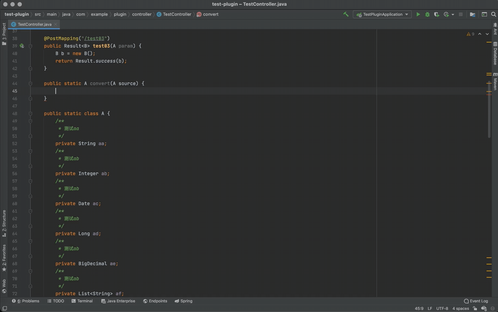
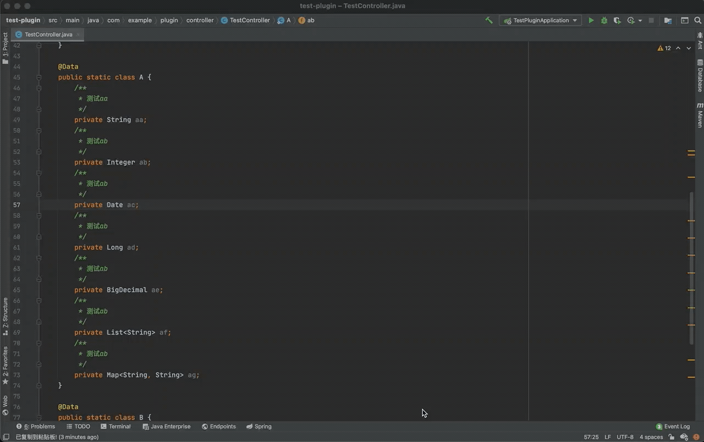
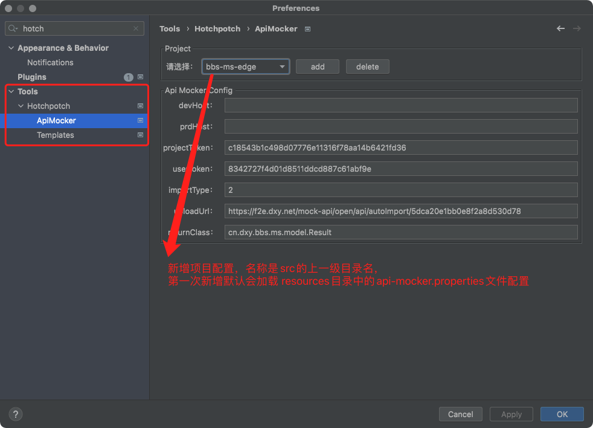
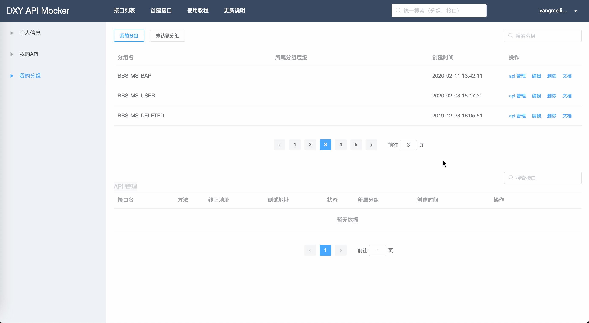

# hotchpotch

- [安装方式](#安装方式)
- [GenerateO2O: 自动对象转换](#hp-generateo2o)
- [ConvertToJson: 自动转换json](#hp-converttojson)
- [UploadToApiMocker: 自动上传接口文档](#hp-uploadtoapimocker)
- [CodeGenerateFromCreateSql: 自动生成代码](#hp-codegeneratefromcreatesql)

## 安装方式

> 下载zip文件，直接拖到idea中（不要解压缩）[安装包位置](./releases/Hotchpotch-latest.zip)

## HP GenerateO2O
### 功能说明
- 自动转换对象
- 右键 或 快捷键 command + n（选择 HP GenerateO2O）

### 动图教程
> 

## <span id="head3">HP ConvertToJson</span>
### 功能及操作说明
- 对象转json
- 右键 或 快捷键 command + n（选择 HP ConvertToJson）

### 动图教程
> 

## HP UploadToApiMocker
### 功能及操作说明
- 自动抽取Controller类中的接口（包含方法注释，参数注释），上传到api-mocker文档中心
- 快捷键：option + o  
- 右键 或 快捷键 command + n（选择 HP UploadToApiMocker）
- 光标位置在类名上则上传整个类所有的接口，光标在某个方法上则上传当前单个接口
- 接口名称提取的方法注释第一行，接口字段名称提取的field上注释第一行
- mock示例值，使用 e.g. 表示，例如:
```java
/**
 * 用户名
 * e.g. zhangsan
 */
private String username;
```
- [社区项目配置文件汇总](https://wiki.dxy.net/pages/viewpage.action?pageId=199319367)

### Api Mocker自动上传配置方式 - 项目配置文件

> 在项目resources路径下创建配置文件：api-mocker.properties
> 
> api-mocker.properties 参数说明：
- importType: 0-追加导入(接口存在的话不会覆盖或合并) 2-智能合并
- projectToken: api-mocker对应分组的token值，获取位置：分组的创建者->接口管理->我的分组->编辑
- uploadUrl: 上传接口 [自动导入api-mocker](https://f2e.dxy.net/mock/#/doc/5feb5de370576303a91c188a/5feb5e68e9ce3003a1c76144)
- returnClass: 统一返回对象封装
- userToken: 提交用户token, 获取位置：api-mocker右上角个人信息->导入接口token
> userToken也可放在idea的项目配置文件中，位置： .idea -> misc.xml
### api-mocker.properties配置文件示例
```properties
importType=2
projectToken=dee736269a542059340b789aa69fca7513e00517 (获取位置：分组的创建者->接口管理->我的分组->编辑)
uploadUrl=https://{host}/mock-api/open/api/autoImport/${分组hash值}(获取位置：进入分组的文档模式，小贴士里有标明)
returnClass=com.example.plugin.controller.Result
userToken=8342727f4d01d8511ddcd887****** (获取位置：api-mocker右上角个人信息->导入接口token)
```
### misc.xml用户token配置示例
```xml
<?xml version="1.0" encoding="UTF-8"?>
<project version="4">
    <component name="MavenProjectsManager">
        <option name="originalFiles">
            <list>
                <option value="$PROJECT_DIR$/pom.xml"/>
            </list>
        </option>
    </component>
    ...
    <api-mocker>
        <userToken>8342727f4d01d8511ddcd887******</userToken>
    </api-mocker>
</project>
```
### Api Mocker自动上传配置方式 - IDE系统配置


### 动图教程
> 

## HP CodeGenerateFromCreateSql
### 功能说明
- 光标置于建表脚本中，自动生成实体类、mapper、dao等模板类
- 快捷键：option + g
- 右键 或 快捷键 command + n（选择 HP CodeGenerateFromCreateSql）
- 默认会生成 entity、mapper、dao和daoImpl四个类，对应的模板文件设置位置：设置->Other Setting->Hotchpotch->Template Settings
### 动图教程
> 